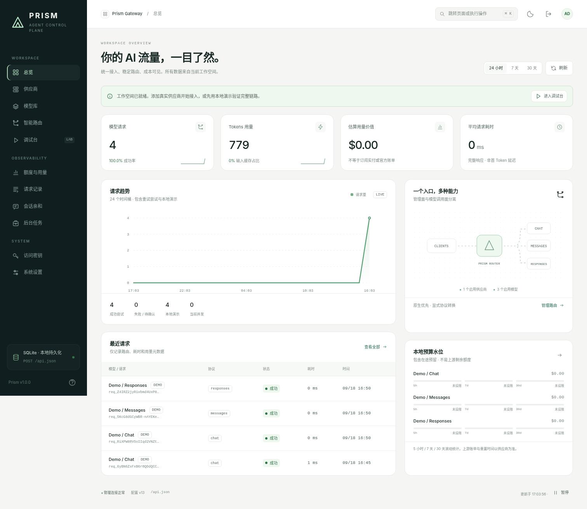

# Prism Gateway

**一个 Go 程序，一个 SQLite，一套内嵌 WebUI。**

面向个人与小型内部工作空间的多协议模型网关。管理操作只经过 `POST /api.json`；模型调用保持 OpenAI Chat Completions、OpenAI Responses、Anthropic Messages 各自的接口形式。

这是可运行的源码交付，不是只有界面的原型。前端资源已随源码提供，Go 编译时通过 `embed.FS` 打包，不需要 npm、Node、CDN 或单独的前端服务器。配置和记录存 SQLite，没有 YAML/TOML/JSON 运行配置文件。

> **构建前提：Go 1.23+、C 编译器、SQLite 开发库。** 本项目使用仓库内的薄 CGo SQLite 绑定，**不是纯 Go SQLite 驱动**。没有第三方 Go 模块，无需 `go mod download`。已在 Linux amd64 与 macOS arm64 实际构建、运行和测试；Windows 请使用 WSL2。

## 界面预览



另见[可视化路由](docs/screenshots/routes.png)与[深色主题](docs/screenshots/dark.png)。截图使用本地演示记录。

## 1. 编译运行

### macOS

先安装 Go。尚未安装命令行开发工具时执行一次：

```bash
xcode-select --install
```

安装完成后，在本项目目录执行：

```bash
./scripts/doctor.sh
CGO_ENABLED=1 go build -o prism-gateway ./cmd/gateway
./prism-gateway
```

macOS 构建使用系统 SDK 的 SQLite。`sqlite3.h not found` 表示开发工具或 SDK 尚未安装完成；不是缺少 Go 模块。

### Ubuntu / Debian / WSL2 Ubuntu

先安装 Go 1.23 或更新版本，再安装 C 构建依赖：

```bash
sudo apt-get update
sudo apt-get install -y build-essential libsqlite3-dev

./scripts/doctor.sh
CGO_ENABLED=1 go build -o prism-gateway ./cmd/gateway
./prism-gateway
```

打开：

```text
http://127.0.0.1:8080
```

终端首次显示一个 `prism_admin_...` 管理员令牌，复制到登录页。它仅在首次创建或显式轮换时显示。**管理员令牌不是模型调用 Key，也不是上游 API Key。**

只要编译工具链已安装，构建可以完全关闭 Go 网络下载：

```bash
GOPROXY=off CGO_ENABLED=1 go build -o prism-gateway ./cmd/gateway
```

Linux 构建静态链接 SQLite；运行机器不需要单独安装 SQLite 数据库进程。Linux 二进制仍依赖 libc/libm，请在目标系统编译，或使用兼容的发行版。不要把它当作跨发行版、跨 CPU 通用的纯静态程序。

### 不填真实 API Key，先验证界面与协议

在 WebUI 总览中点击“启用演示”。这会新增明确标注的 `Local Sandbox`、三个 `demo-*` 模型与 `demo-auto` 路由。

演示是本地确定性回复，**不是 LLM，不会访问云端**。它仍经过真实鉴权、路由、协议封装和记录流程。演示请求标记 `DEMO`，不会伪造云端账单。

## 2. 连接真实供应商

在“供应商”添加上游名称、Base URL 和 API Key。OpenCode Go 预设 Base URL 为：

```text
https://opencode.ai/zen/go/v1
```

这里必须是上游的 API 根路径，不要填写文档页面，也不要把 `/messages`、`/responses`、`/chat/completions` 拼到 Base URL 后面。

点击“测试连接”检查 `GET /models`，然后“同步模型”。同步是异步任务，可在“后台任务”查看结果。不是每一家上游都提供 `/models`；无法同步时仍可手动添加模型。

**同步的新模型默认禁用。** 到“模型库”确认真实模型 ID、原生协议、工具/图片能力、输出上限、并发与价格，再启用。内置少量 OpenCode Go 协议映射仅作为同步时的初始提示；新型号、供应商行为及价格必须按实际账户确认，不自动编造额度。

在“智能路由”创建 `auto-coding` 等入口，将已启用模型加入候选池；拖动或用上下箭头排序，点击“应用排序”。原生兼容优先、会话亲和、本地预算压力与候选优先级决定选择。静态“模拟选择”不会产生模型调用费用。

到“访问密钥”创建一个 `prism_sk_...`。客户端只持有这个网关 Key；供应商密钥始终留在后端。

## 3. 客户端接入

| 客户端协议 | Base URL | 主要入口 |
| --- | --- | --- |
| OpenAI 风格 SDK | `http://127.0.0.1:8080/openai/v1` | `chat/completions`、`responses` |
| Anthropic 风格 SDK / Claude Code | `http://127.0.0.1:8080/anthropic` | SDK 再追加 `/v1/messages` |
| 后台、脚本 | `http://127.0.0.1:8080/api.json` | 单入口 RPC |

### 最小 curl 示例

先在界面创建客户端 Key：

```bash
export PRISM_API_KEY='替换为创建时显示的 prism_sk_...'

curl --fail-with-body http://127.0.0.1:8080/openai/v1/chat/completions \
  -H "Authorization: Bearer $PRISM_API_KEY" \
  -H 'Content-Type: application/json' \
  -d '{"model":"demo-chat","messages":[{"role":"user","content":"Hello"}]}'
```

Anthropic 流式测试：

```bash
curl --fail-with-body -N http://127.0.0.1:8080/anthropic/v1/messages \
  -H "x-api-key: $PRISM_API_KEY" \
  -H 'anthropic-version: 2023-06-01' \
  -H 'Content-Type: application/json' \
  -H 'X-Prism-Session: my-conversation-001' \
  -d '{"model":"demo-messages","max_tokens":256,"stream":true,"messages":[{"role":"user","content":"Hello"}]}'
```

更多请求见 [examples/requests.sh](examples/requests.sh)，Claude Code / Codex 接入见 [docs/CLIENTS.md](docs/CLIENTS.md)。真实 Agent 建议先选**相同原生协议**的固定模型，验证后再启用自动路由。

## 4. 已实现的功能

| 模块 | 实现 |
| --- | --- |
| WebUI | 中文工作空间、明暗主题、响应式布局、Cmd/Ctrl+K 命令面板、侧边编辑抽屉、键盘可操作的路由排序、真实统计与空状态 |
| 管理入口 | 仅 `POST /api.json`，action 分发、统一错误、请求 ID、配置版本校验、只读批量调用 |
| SQLite | WAL、事务、外键、启动 schema 校验、原子配置快照、重启恢复、进程级数据库锁 |
| 密钥 | 管理登录、HttpOnly Cookie + CSRF；客户端 Key 权限范围与撤销；供应商凭证 AES-GCM 加密 |
| 三协议 | 原生转发；常用文本、图片引用、函数工具调用及结果的显式跨协议转换；SSE 转发和转换 |
| 路由 | 显式模型、路由与别名；优先级 / 本地预算压力均衡；会话亲和；安全的 429/503 备用切换 |
| 速率与预算 | 全局/模型并发、模型 RPM、冷却；滚动 5h/7d/30d 本地预算；在途预留与未知用量保留 |
| 运维 | 免鉴权 `GET /healthz` 探活；`GET /metrics` Prometheus 导出（默认关闭，需管理员令牌）；`config.export` / `config.import` 无凭证配置迁移；`backup.create` 在线一致性快照；slog 日志与监听地址后台热调整 |
| 观测 | 元数据日志、协议模式、实际供应商/模型、用量、缓存 token、费用估算、后台同步任务与操作审计 |
| 本地 Sandbox | 三协议普通响应和 SSE，可离线验证链路，始终标注为演示 |

## 5. 明确的边界

这是个人 / 小型内部网关，不是公共转售、多租户结算或高可用集群产品。一个数据库只允许一个进程，默认仅监听回环地址。进程重启会重置内存中的 RPM 窗口和短期冷却，不会清空持久化的生成请求预算记录。

**协议兼容不等于全部厂商功能等价。** 相同原生协议保留请求和响应中的厂商字段；跨协议只转换明确实现的公共子集。Thinking 签名、加密推理项、服务端工具、PDF、音频、任意 JSON Schema 限制等不会静默“翻译”为别的语义。详见 [兼容性矩阵](docs/COMPATIBILITY.md)。

本版本不实现 Responses WebSocket、Files API、Batch API、远端 Response 检索/取消/删除、网关侧 Agent 工具执行、自动代码农场或外部账单同步。原生 `background:true` 不应使用，因为本版本没有对应的响应轮询端点。不要把“可以转发 JSON”理解为这些完整工作流已实现。

**本地预算不等于上游余额。** 5h/7d/30d 是本项目的滚动保护窗口，不冒充供应商固定周/月账期。没有官方余额 API，无法保证精确知道剩余额度。请求前预留使用本地输入估算，不是精确 tokenizer 上限；它降低超支风险，但不能保证绝不越过金额阈值。未知费用不会作为已确认零成本处理。

会话亲和只记录路由绑定，不是永久模型记忆，不会储存提示词，不会保证供应商 Prompt Cache 永不过期。缓存 token 来自上游 usage，Prism 不会自动预热、重复刷请求或本地缓存代码回答。

网关故障切换只在尚未开始向客户端输出时，针对安全请求及明确的上游 429/503；中途断流、网络状态不明、服务端会话或内建工具请求不自动重放。客户端自己的重试仍需单独配置。

## 6. 数据与备份

默认首次运行生成：

```text
data/
  gateway.db          # 配置、元数据、用量
  gateway.db.key      # 32-byte 凭证加密主密钥，必须备份
  gateway.db.lock     # 进程锁
  gateway.db-wal      # 运行时可能存在
  gateway.db-shm      # 运行时可能存在
```

**数据库不是整库加密。** 加密的是供应商凭证；主密钥旁置，是引导秘密，不是业务配置文件。拥有数据库与配套 `.key` 的人可以恢复上游凭证，因此整个 data 目录都必须保护。

在线备份：管理后台或 `backup.create` 用 SQLite 的 `VACUUM INTO` 生成一致性快照，**不需要停服务**，也不会漏掉 WAL 里尚未合并的内容。快照落在 `data/backups/`，**不含 `.key`**——恢复上游凭证必须配套原主密钥，请把 `.key` 单独备份到另一处。

完整冷备份：停止网关进程，复制整个 data 目录，再启动。不要仅复制运行中的 `.db` 而忽略 WAL。升级前也先备份。主密钥丢失后无法恢复上游密钥，需要重新配置。

另有 `config.export` / `config.import` 用于**配置迁移**：导出的 JSON 含供应商、模型、路由、别名和设置，**不含任何凭证**，可以安全放进配置仓库。导入时按 provider id 保留本机已有的加密凭证，新供应商需重新填写 Key。它替代不了上面的整目录备份——请求记录、用量、客户端 Key 都不在导出范围内。

```bash
curl -s http://127.0.0.1:8080/api.json \
  -H "Authorization: Bearer $PRISM_ADMIN_TOKEN" -H 'Content-Type: application/json' \
  -d '{"action":"config.export","params":{}}' > prism-config.json
```

丢失管理员令牌：停止旧进程后运行 `./prism-gateway --reset-admin`。它轮换管理令牌、注销管理会话，不删除配置或上游凭证。

## 7. 常用命令

```bash
make build                    # 产物 bin/prism-gateway
make test                     # 自动化测试
make race                     # Go 竞态检测
make vet                      # Go 静态检查
make ui                       # WebUI 浏览器冒烟（需 playwright，缺失自动跳过）
make cover                    # 覆盖率门禁
make lint                     # staticcheck（未安装则跳过）
make hooks                    # 安装 pre-commit 与 pre-push 钩子
make release                  # 可复现构建 + SHA256 校验和
make hooks                    # 安装 pre-push 质量门（推送前自动跑 make check）
python3 scripts/smoke.py --binary ./bin/prism-gateway  # 实际进程冒烟；先 make build
./prism-gateway --help
./prism-gateway --db ./data/work.db
./prism-gateway --listen 127.0.0.1:9090   # 救援覆盖：仅本次启动生效，不写入配置
curl -sf http://127.0.0.1:8080/healthz   # 免鉴权存活探测；数据库异常时返回 503
```

前端直接修改 `internal/webui/dist/assets/` 内源码，再重新 `go build` 即可。这里保存的是可读的 ES Module / CSS 源码，没有缺失的前端构建步骤。网页不从 CDN 加载运行库或字体。改完跑 `make ui`：它会真的启动二进制、用浏览器走完 11 个页面与关键交互，并断言零 console 错误。

**运行参数只剩 `--db` 是日常需要的。** 监听地址、日志级别与格式、并发、预算等全部在管理后台修改，保存即生效。`--listen` 降级为救援覆盖（仅本次启动生效，不写回配置）；`--allow-remote` 与 `--tls-*` 是启动期的安全边界——拿到管理令牌的人不能因此把网关暴露到公网。

改监听地址时先占用新地址，占不住则配置与服务都不变，不会因为一次手滑把自己关在门外。

日志级别与格式在“系统设置”里改，保存即生效，不需要重启。默认 `info` + `text`；接日志采集器时切 `json`。临时排障可切 `debug`，它会额外记录管理接口的错误详情——**这些详情可能包含刚提交的配置片段，排障结束请调回 `info`**。启动横幅和管理员令牌只写终端，不进日志流。

外网访问需显式 `--allow-remote`，并配置 TLS 或可信 HTTPS 反向代理；不要直接裸露 HTTP。详见 [安全与部署](docs/SECURITY.md)。Dockerfile 是额外交付方式，构建镜像需要网络拉取基础镜像和系统开发包；不影响本机离线 Go 构建。

## 8. 文档导航

- [管理 RPC 与数据结构](docs/API.md)
- [协议兼容矩阵与错误边界](docs/COMPATIBILITY.md)
- [客户端配置](docs/CLIENTS.md)
- [架构与目录](docs/ARCHITECTURE.md)
- [安全、部署、备份](docs/SECURITY.md)
- [实测记录与未验证范围](docs/TEST_REPORT.md)
- [维护者约束](AGENTS.md)
- [参与开发](CONTRIBUTING.md)
- [安全策略](SECURITY.md)
- [部署示例](deploy/README.md)

版本 1.4.0 · MIT · 实际测试状态以 `docs/TEST_REPORT.md` 为准。
